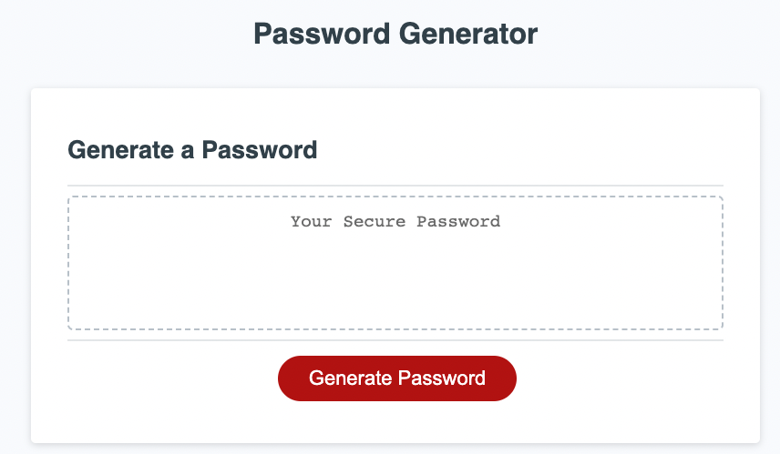

# Password Generator

## Description

This application is for employees to generate a random password based on selected criteria.

## Installation

N/A

## Usage

The deployed webpage can be accessed [here](https://pholobo.github.io/password-generator/).

Once you click 'Generate Password', you will be prompted to answer a few questions regarding password criteria. 

1. Password Length (between 8 - 128 characters)
2. If you'd like to include lowercase alphabet characters (abcdefghijklmnopqrstuvwxyz)
3. If you'd like to include uppercase alphabet characters (ABCDEFGHIJKLMNOPQRSTUVWXYZ)
4. If you'd like to include numbers (0123456789)
5. If you'd like to include special characters (!"#$%&'()*+,-./:;<=>?@[\]^_`{|}~)

## Credits

N/A

## License

Please refer to the LICENSE in the repo.
